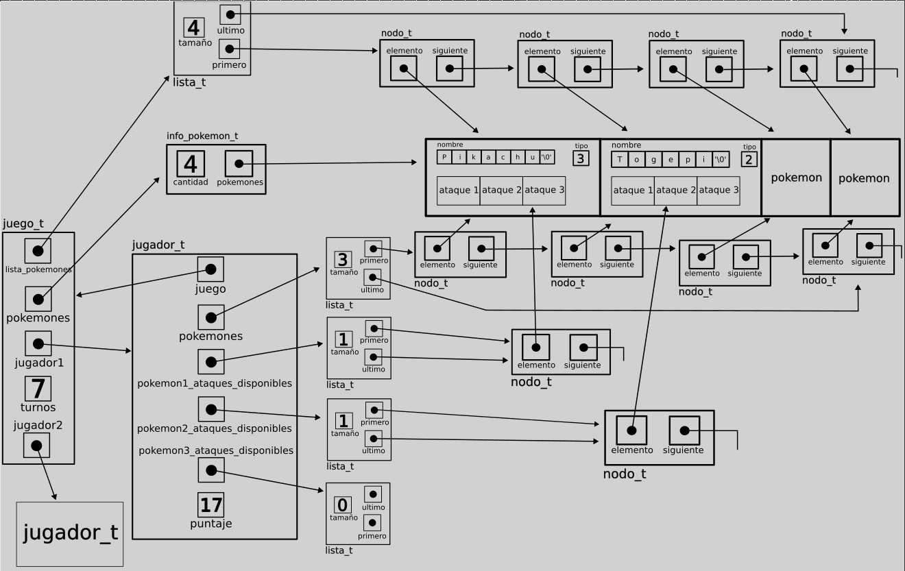

<div align="right">
</div>

# JUEGO POKEMON EN CONSOLA

- Para compilar:

```bash
gcc src/*.c main.c -o main
```

- Para ejecutar:

```bash
./main
```

- Para ejecutar con valgrind:
```bash
valgrind ./main
```

---

## Reglas del juego

- El juego requiere de 2 jugadores. 
- Al principio del juego se le presenta a los jugadores un listado de los pokemon disponibles.
- Cada jugador selecciona 3 pokemon de los disponibles.
  - Los 3 pokemon deben ser diferentes, no se puede repetir pokemon
  - Ambos jugadores realizan su elección sin conocer la elección del otro jugador
- Una vez seleccionados los pokemon por ambos usuario, se informan las elecciones.
  - Los primeros 2 pokemon seleccionados por el usuario son pokemon propios mientras que el tercer pokemon debe ser asignado como tercer pokemon del otro jugador
  - Por ejemplo, el jugador 1 selecciona A, B y C; el jugador 2 selecciona D, E y F. El equipo final del jugador 1 está formado por A, B y F, mientras que el equipo de jugador 2 queda D, E y C.
  - Si bien cada jugador debe seleccionar 3 pokemon diferentes, es posible que en el equipo final queden pokemon duplicados (ya que el tercer pokemon es elegido secretamente por el otro jugador)
- El juego se desarrolla por rondas. Como cada jugador tiene 3 pokemon y cada pokemon tiene 3 ataques, la cantidad de rondas del juego siempre es 9.
  - En cada ronda cada jugador decide un pokemon y un ataque de ese pokemon.
  - Los pokemon seleccionados se enfrentan.
  - Se le asigna a cada jugador un puntaje que se calcula en base al poder del ataque y el tipo del ataque y del pokemon adversario.
  - Una vez utilizado un ataque de un pokemon, este no puede ser utilizado nunca mas durante el juego.
- Al finalizar el juego, gana el jugador con mas puntos.

##  Funcionamiento

### TDA Juego

#### Estructura
Para el juego, decidí utilizar una estructura que contiene por un lado toda la información de los pokemones disponibles en un __informacion_pokemon_t__, que ya fue implementado en el tp1.

Además, tenía una __lista simplemente enlazada__ con los pokemones cargados, para devolverla en la función __juego_listar_pokemon__ y tener la referencia para luego liberarla al destruir el juego. 

Luego tenía ambos jugadores en TDAS __jugador__, cuyo funcionamiento explicaré más adelante. Sin embargo, adelanto la estructura para entender el gráfico de abajo. Cada jugador posee un puntero al __juego__ al que pertenecen, una __lista simplemente enlazada__ con sus pokemones seleccionados, y luego tres __listas simplemente enlazadas__ con los ataques disponibles de cada pokemon, donde la primera lista corresponde al primer pokemon de la lista de pokemones, y así con las demás. Por último, tiene su __puntaje__ actual.

Por último, tenía un contador de los turnos jugados, para saber en qué momento se termina el juego (a los 9 turnos).

<div align="center">

</div>

_Representación gráfica de un ejemplo de juego en memoria._

#### Funcionamiento

Aclaración: todas las funciones del __TDA jugador__ serán explicadas más adelante, en el apartado correspondiente al TDA.

---
En __juego_crear__, reservé memoria para el juego, y creé por un lado la lista de pokemones con __lista_crear__, y por el otro, ambos jugadores, con la función __jugador_crear__ del __TDA jugador__. A cada paso, fui chequeando las asignaciones de memoria.

---
En __juego_cargar_pokemon__ utilicé obviamente la función __pokemon_cargar_archivo__ del __TDA Pokemon__ implementado en el TP1. El resultado de esta función, que es un __info_pokemon_t *__, lo asigné a __juego->pokemones_disponibles__, tras lo cual chequeé su cantidad de pokemones con __pokemon_cantidad__, y si era menor a 4, destruía los pokemones con __pokemon_destruir_todo__ y devolvía __POKEMON_INSUFICIENTES__.

Si los pokemones se habían cargado correctamente, llamaba a __juego_llenar_lista_pokemones__, función que se encargaba de llenar la __lista simplemente enlazada__ de __juego->lista_pokemones__.

En esta función, primero llamaba a __con_cada_pokemon__, pasando por parámetro los pokemones de __juego->pokemones_disponibles__ y la función __insertar_pokemon_en_lista__, para ir insertando cada pokemon a la lista, la cual pasaba a la función como contexto. Simplemente llamaba a __lista_insertar__ con la lista y el pokemon.

Por último chequeaba el tamaño de la lista con __lista_tamanio__ para ver si se habían insertado todos los pokemones correctamente. Si había ocurrido un error, destruía todos los pokemones cargados y llamaba a __lista_vaciar__, donde quitaba todos los elementos de la lista. No podía destruirla porque si se intentaba cargar el archivo llevaría a un error, porque la lista se creó al crear el juego.

Dado que al implementar __pokemon_cargar_archivo__ en el TP1 realicé un realloc de a un elemento (cada vez que insertaba un pokemon en la lista de info_pokemon_t), este realloc tiene una complejidad computacional __O(n)__ (recordemos que realloc debe recorrer todo el vector y pasar cada elemento a otro vector y luego eliminar el original). En cambio, si se hiciera de a varios elementos, se termina amortizando y se convierte en __O(1)__, pues tenemos que realizar operaciones "pesadas" cada más tiempo, pero mientras tanto las demás operaciones son __O(1)__, ya que tenemos el espacio necesario para seguir insertando elementos en el vector (operación __O(1)__), porque tenemos espacio de sobra. Por lo tanto, __pokemon_cargar_archivo__ termina teniendo una complejidad computacional __O(n²)__, veamos por qué, teniendo en cuenta que n es la cantidad de pokemones que se van cargando:

```txt
// El realloc va haciendo operaciones de la siguiente forma a medida
// que cargamos pokemones en el vector dinámico:
1 + 2 + ... + (n - 2) + (n - 1) + n
// Reunimos los opuestos
(n - 2 + 2) + (n - 1 + 1) + ... + n
n + n + ... + n
// Esta sumatoria da
n * (n - 1) / 2 = n² / 2 - n / 2 
```

Para determinar una complejidad computacional con __Big O__, nos quedamos con que es __O(n²)__. En la función __juego_cargar_archivo__ tenemos otras operaciones de complejidad __O(n)__, pero como son de un "menor orden", nos quedamos con la complejidad de __pokemon_cargar_archivo__. 

Por lo tanto, __juego_cargar_archivo__ tiene una complejidad computacional __O(n²)__.

---
En __juego_seleccionar_pokemon__, luego de realizar los chequeos pertinentes (si el juego no estaba finalizado, si el jugador ya había seleccionado sus pokemones y si había pokemones repetidos), llamé a __jugador_asignar_pokemones_y_ataques__, que es una función del __TDA jugador__ que explicaré más adelante. En esta función llené la lista de pokemones del jugador y las tres listas de ataques. Luego, si ambos jugadores habían seleccionado sus pokemones, llamaba a __jugadores_intercambiar_tercer_pokemon__, que es una función del __TDA jugador__ que se encarga de intercambiar los terceros pokemones de ambos jugadores (el tercer elemento de la lista de pokemones y la tercera lista de ataques de pokemon). 

Para insertar los pokemones en cada jugador, debemos buscar los pokemones con los nombres pasados por parámetro, lo cual es __O(n)__ en el peor caso (que algún pokemon esté al final de la lista). Luego insertamos los 3 pokemones, con 3 operaciones __O(1)__ (__lista_insertar__ tiene complejidad __O(1)__), y luego debemos ingresar los 3 ataques de cada pokemon en su lista correspondiente, lo que constituye 9 operaciones __O(1)__. Por lo tanto, la inserción de todos los pokemones y sus ataques en el jugador es una operación de tiempo constante (__O(1)__). Es decir que __juego_seleccionar_pokemon__ tiene una complejidad computacional __O(n)__, por la búsqueda de los 3 pokemones según su nombre.

Observemos que, si utilizáramos otro TDA para guardar los pokemones, como un __abb__ o un __hash__, la búsqueda de los pokemones sería más eficiente, pero tendríamos que utilizar más memoria ya que la utilización de la __lista simplemente enlazada__ es indispensable para implementar __juego_listar_pokemon__ y luego tener una referencia a la lista para liberarla. Además, el __hash__ que implementé utiliza __listas simplemente enlazadas__, por lo que la búsqueda con colisiones es __O(n)__ (con un "n" obviamente menor porque dividimos en varias listas), y el __abb__ puede degradarse en lista, por lo que perderíamos la búsqueda __O(log(n))__. Es por esto que no vale la pena utilizar una cantidad bastante mayor de memoria para guardar los pokemones en otro TDA.

---
En __juego_jugar_turno__, primero inicializo los dos pokemones con __inicializar_pokemon__, donde paso el nombre del pokemon de la jugada y busco el pokemon en la lista de pokemones del jugador correspondiente a esa jugada, con un comparador del __TDA comparador__. Decidí crear un TDA exclusivo para comparadores porque utilicé varias veces distintas funciones de comparación que se repetían a lo largo del código en los distintos TDAS y en el main, y para no repetir tantas veces la declaración de una misma función, resumí todos los comparadores necesarios en un TDA.

Volviendo a __juego_jugar_turno__, si alguno de los dos pokemones era NULL luego de inicializarlos es porque no estaban disponibles para utilizar por el jugador, por lo que era un ataque inválido. Luego de inicializar los pokemones inicialicé los ataques con __jugador_quitar_ataque_de_pokemon__, que es una función del __TDA jugador__ que recibe un jugador, un nombre de pokemon y un nombre de ataque, y quita el ataque de la lista de ataques del pokemon correspondiente. Por ejemplo si el pokemon "Togepi" del jugador1 está en su lista de pokemones disponibles en la segunda posición, y quiero utilizar su ataque "Retribución" que también está en su lista de ataques disponibles (en este caso la segunda, porque Togepi está en la segunda posición de la lista), entonces quito el ataque Retribución de la lista y lo devuelvo. De esta manera, al mismo tiempo que quito el ataque utilizado de la lista de ataques disponibles, me fijo si en verdad está disponible, ya que de no estarlo, la función simplemente devuelve NULL. Recordemos que el jugador solo puede utilizar una sola vez cada ataque, por lo que es necesario eliminarlo.

Por último, luego de ver que ambos pokemones y ambos ataques están disponibles, asigno los resultados del ataque de cada jugador con la función __jugador_resultado_ataque__, la cual (con un montón de ifs horribles) compara los tipos del ataque y el pokemon atacado para devolver si el ataque fue eficiente, ineficiente o regular. 

Por último actualizo los puntajes de ambos jugadores con __actualizar_puntaje_jugador__, que recibe el resultado del ataque y actualiza el puntaje en consecuencia.

En cuanto a la complejidad computacional, __juego_jugar_turno__ es claramente __O(n)__, pues debemos buscar ambos pokemones y ataques en la lista de los jugadores, lo cual constituye una operación __O(n)__. Lo demás son todas operaciones de tiempo constante (asignar los resultados y actualizar los puntajes).

---
Por último tenemos __juego_destruir__, donde llamo a __pokemon_destruir_todo__ para destruir __juego->pokemones_disponibles__, a __lista_destruir__ para destruir __juego->lista_pokemones__, y a __jugador_destruir__ para destruir ambos jugadores, función en la cual simplemente destruyo todas las listas del jugador y libero al jugador. Por último, libero el juego.

Obviamente es una función que requiere varias operaciones de complejidad __O(n)__, por lo que es __O(n)__.

### TDA Jugador
Como ya expliqué su estructura al explicar la del juego, paso directamente al funcionamiento.

#### Funcionamiento

---
En __jugador_crear__, simplemente reservo memoria para el jugador, asigno el juego y creo todas las listas de la escructura con __lista_crear__.

---
En __jugador_asignar_pokemones_y_ataques__, función que como ya adelanté antes se encarga de llenar la lista de pokemones y las listas de ataques del jugador a partir de los nombres de los 3 pokemones, primero llena la lista de pokemones con __llenas_lista_de_pokemones__, que recibe el juego, la lista de pokemones del jugador y los 3 nombres, y busca los pokemones en la lista de pokemones disponibles del juego usando las funciones __lista_buscar_elemento__, __juego_listar_pokemon__ , y el comparador __comparador_nombres_pokemon__. Si alguno de los pokemones es NULL es porque no está disponible. Si los 3 pokemones están disponibles, los inserto en la lista de pokemones del jugador con la función __insertar_pokemones__. Si alguno de los pokemones no se pudo insertar, vacío la lista.

Volviendo a __jugador_asignar_pokemones_y_ataques__, luego de llenar la lista de pokemones, debo llenar las 3 listas de ataques de cada pokemon con la función __llenar_listas_de_ataques__, en la cual, un bucle __for__ va aumentando una variable __i__ de 0 a 2, que paso como parámetro a la función __llenar_lista_ataques_de_pokemon__. Esta última recibe un jugador y un índice de pokemon, con el cual asigna una lista de ataques. Es decir, si el índice es 0, se llena la lista pokemon1_ataques_disponibles con los ataques del pokemon que se encuentra en la posición 0 de la lista de pokemones del jugador, y lo mismo con el 1 y 2. 

Luego de asignar la lista de ataques correspondiente, utilizo la función __con_cada_ataque__ pasando al pokemon correspondiente al indice, la lista de ataques y la función __insertar_ataque_en_lista__, en la que simplemente llamo a __lista_insertar__ con la lista de ataques y el ataque actual. Si el tamaño de la lista de ataques es menor a 3 es porque ocurrió algun error al insertar, por lo que vacío la lista.

En cuanto a la complejidad computacional de __jugador_asignar_pokemones_y_ataques__, por las razones que expliqué en el apartado de __juego_seleccionar_pokemon__, es __O(1)__.

---
En __jugador_quitar_ataque_de_pokemon__, función que como también adelanté se encarga de eliminar un ataque de la lista de ataques de un pokemon del jugador a partir de los nombres de ambos elementos, primero busca la posición del pokemon en la lista de pokemones del jugador utilizando __lista_con_cada_elemento__, que recorre la lista de pokemones del jugador comparando el nombre de cada pokemon con el nombre pasado a la función, con el comparador __nombres_pokemon_son_diferentes__, y devuelve false si los pokemones son iguales. De esta manera corta la iteración y me devuelve la cantidad de pokemones iterados, que también es la posición del pokemon que estoy buscando. Si la posición es 3 es porque el pokemon no está disponible.

Con esta posición inicializo la lista de ataques con __jugador_listar_ataques__, que recibe el jugador y la posición del pokemon y devuelve la lista de ataques correspondiente, y ahora busco la posición del ataque correspondiente al nombre recibido por parámetro con la misma lógica con la que buscaba el nombre del pokemon, pero esta vez utilizando el comparador __nombres_ataque_son_diferentes__. De nuevo si la posición es igual al tamaño de la lista de ataques es porque el ataque no está disponible.

Por último, con la posición del ataque, utilizo __lista_quitar_de_posición__ para quitar el ataque de la lista.

La complejidad computacional de esta función depende de la posición del pokemon y los ataques, pero como sabemos que tenemos 3 pokemones y como máximo 3 ataques por pokemon (esa cantidad va disminuyendo a lo largo del juego), la cota superior del tiempo de ejecución de la función es constante, por lo que tiene complejidad computacional __O(1)__. Como máximo iteramos los 3 pokemones para buscar la posición del pokemon, los 3 ataques del pokemon para buscar la posición del ataque, y los 3 ataques de nuevo para quitar el ataque. Es decir que, en el peor caso, realizamos 9 operaciones de tiempo constante.

---
En __jugadores_intercambiar_tercer_pokemon__, función que intercambia el tercer pokemon del jugador1 con el del jugador2 y viceversa junto con sus listas de ataques correspondientes, primero inserto al final de la lista de pokemones del jugador1 el elemento que quité del final de la lista de pokemones del jugador2, y luego inserto al final de la lista de pokemones del jugador1 el elemento que quité de la posición 2 de la lista de pokemones del jugador2. Si alguna de estas inserciones falla, vacío ambas listas.

Si este intercambio se realiza satisfactoriamente, intercambio la tercera lista de ataques de cada jugador entre sí, utilizando una lista auxiliar para tener una referencia temporal a la lista de ataques del pokemon en la tercera posición del jugador1.

Esta función tiene complejidad computacional __O(1)__, porque son todas operaciones de tiempo constante (__lista_insertar__, __lista_quitar__, __lista_quitar_de_posicion__ con posición 2, vaciar listas que tienen una cantidad constante de elementos, e intercambiar referencias de punteros a listas).

---
Por último, en __jugador_destruir__, simplemente destruyo todas las listas del jugador con la función __destuir_listas_jugador__, y libero el jugador.

En el peor caso, esta operación debe destruir 4 listas con 3 elementos cada una, realizando en total 17 operaciones de tiempo constante (quitar 12 elementos, liberar 4 listas y liberar el jugador). Por lo tanto, el tiempo de ejecución tiene una cota superior constante. Es decir que la complejidad computacional de __jugador_destruir__ es __O(1)__.

### TDA Adversario

#### Estructura
Decidí no crear una estructura adversario_t, sino que reutilicé al __TDA Jugador__ para todas las operaciones. Es decir que el __TDA Adversario__ utiliza la estructura del __TDA Jugador__.

#### Funcionamiento
Solo implementé la función __adversario_proxima_jugada__ haciendo que elija la jugada de forma aleatoria. Decidí esto porque por un lado no tuve el tiempo suficiente para hacer algo más complejo, y por el otro porque ni yo sé como jugar de forma "inteligente" al juego ya que no tengo experiencia en juegos de este estilo.

Lo que hice en __adversario_proxima_jugada__ fue, primero, buscar un número aleatorio entre 0 y 2 con __rand() % 3__. Con este índice seleccionaba algún pokemon del jugador. Mientras que la lista de ataques de ese pokemon estuviera vacía, buscaba un nuevo índice. Esto es para respetar que el pokemon pasado a la jugada debe tener ataques disponibles.

Luego inicializaba el pokemon correspondiente a esa posición, sabiendo que seguro tenía ataques.

Con todo esto, buscaba un ataque aleatorio en la lista de ataques del pokemon correspondiente pasando otro __rand() % 3__ como posición de lista a __lista_elemento_en_posición__, y pasando como lista la lista de ataques del pokemon seleccionado, con __jugador_listar_ataques_de_pokemon__. Repetí esto en un while mientras que esa posición no existiera en la lista de ataques (si por ejemplo la lista de ataques tiene 2 elementos y paso 2 como posición, eso devuelve NULL).

Con el pokemon y el ataque seleccionados, obtenía los nombres de ambos con __pokemon_nombre__ y __ataque->nombre__ respectivamente, y devolvía una jugada con estos nombres.

Esta función tiene una mínima posibilidad de entrar en un bucle infinito o muy largo, ya que podría darse que rand() % 3 devuelva muchas veces el mismo número, y si justo ese número no está disponible como posición para seleccionar un pokemon o un ataque, entonces el bucle seguiría indefinidamente. Aun así esto es casi imposible, y al tener 3 posiciones posibles, la función __lista_elemento_en_posición__ tiene una cota superior constante. Es por esta mínima posibilidad que es muy dificil asignarle una complejidad computacional a esta función, pero podríamos decir, en términos prácticos, que es __O(1)__, sacando la posibilidad de un bucle infinito, y pensando que como máximo las operaciones de __lista_elemento_en_posición__ iteran hasta 3 elementos.


### TDA Menú
Este TDA fue utilizado para que el usuario pueda jugar. La idea es que se pueda utilizar para cualquier cosa, no solamente para este juego en particular.

#### Estructura
Aunque el TDA tiene una estructura __menu_t__, utilicé el __TDA Hash__ para todas las operaciones del menú, ya que básicamente lo que hace el menú es guardar comandos con sus respectivas funciones (en términos de diccionarios, el comando funciona como clave y la función como valor de esa clave), y luego ejecuta la función correspondiente cuando se le pasa un comando. Es decir que básicamente hace un __hash_insertar__ con un par comando-función, y luego un __hash_obtener__ con cierto comando. Por lo que el __hash__ es el TDA idóneo para el __menú__. Además, optimiza mucho la búsqueda de los comandos para ejecutar las funciones.

Vale aclarar que cada función recibe un void pointer como contexto para ejecutarse. Es decir que realiza cierta operación sobre ese contexto.

#### Funcionamiento
El __TDA Menú__ tiene un enum __RESULTADO_MENU__, cuyos elementos se utilizan como retorno de las funciones de cada comando. Estos datos enumerados son __MENU_OK__ para cuando la función se ejecuta satisfactoriamente, __MENU_ERROR__ si hay algún inconveniente al ejecutar la función, __MENU_INEXISTENTE__ si el comando no está disponible en el menú, y __MENU_SALIR__ si por algún error de memoria o porque el jugador ingresa un comando para salir del menú, se debe justamente salir del menú (en este caso del juego).

---
En __menu_crear__, básicamente hice __hash_crear__, ya que en el fondo el menú es un hash.

---
En __menu_agregar_comando__, reservé memoria para una estructura auxiliar que contiene a la función del comando para poder pasarlo como void pointer a __hash_insertar__, función a la que llamé para insertar el par comando-función.

Es decir que básicamente utilizo __hash_insertar__.

---
En __menu_ejecutar_comando__, utilizo __hash_obtener__ pasando el comando como parámetro para obtener su función. Si esto devuelve NULL es porque el comando no existe, y devuelvo __MENU_INEXISTENTE__. Si no, devuelvo el valor de retorno de la función.

__menu_ejecutar_comando__ recibe un void pointer __contexto__ como parámetro además del comando, que se utiliza para llamar a la función del comando.

---
Por último, en __menu_destruir__ llamo a __hash_destruir_todo__ con el menu y free, para destruir todas las estructuras que contienen a las funciones.